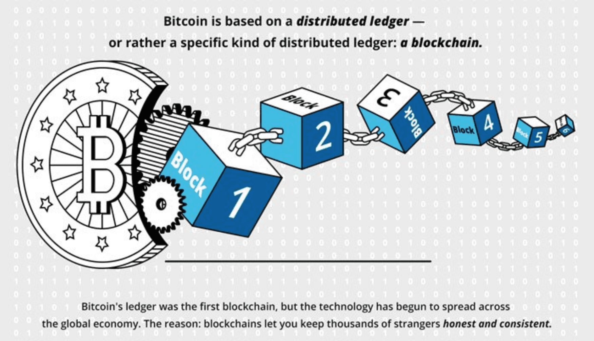
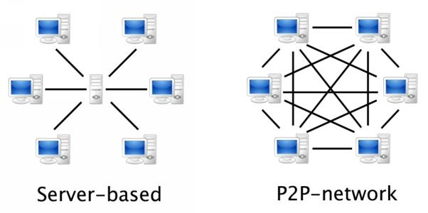
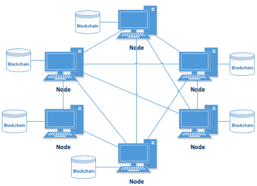
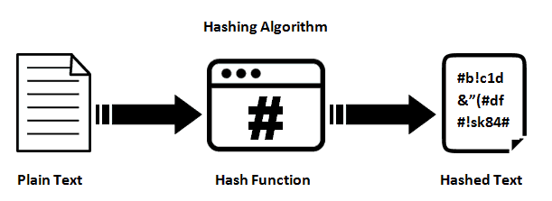
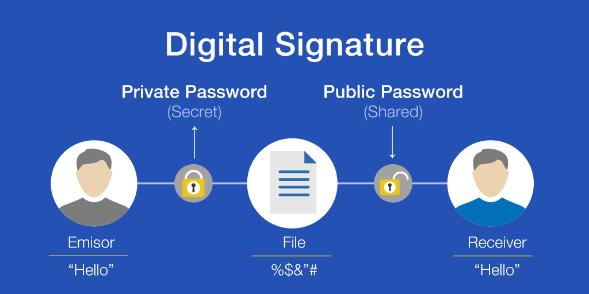
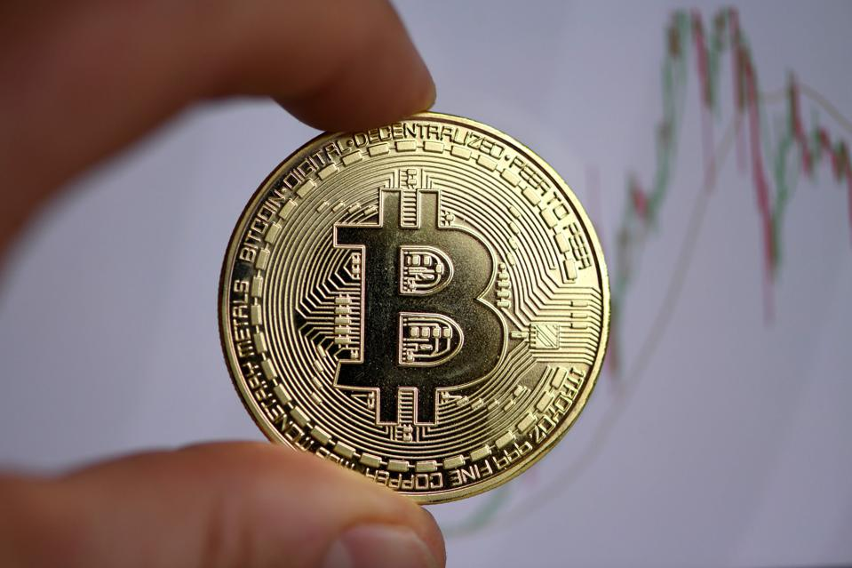
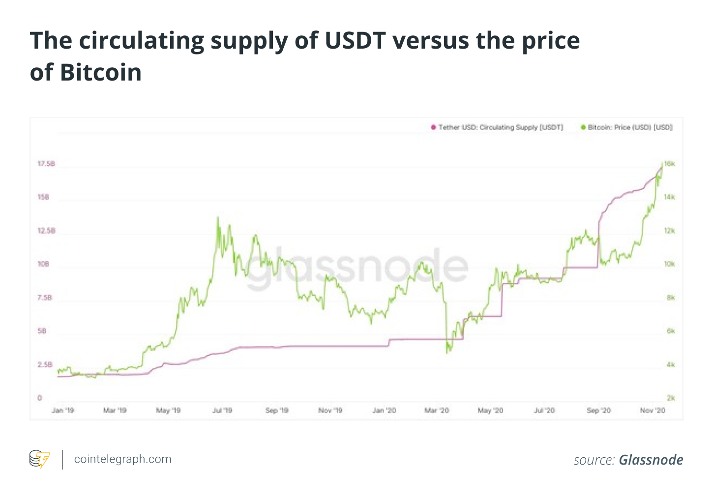

---

title : Cryptocurrency "The Emerging Future"
date : "2020-11-14"
description: In this blog post , Rahul has been talking about THE EMERGING FUTURE because of the cryptocurrency and how we are going to adopt cryptocurrency like 'Bitcoin','Etherum','Litecoin' etc. in near future.
 

---

## What is CryptoCurrency

Cryptocurrency is a Peer-to-Peer (P2P) programmable digital currency. It allows online payments to be sent directly from one party to another party without going through an intermediary.
CryptoCurrency is an alternative money currency cult which works on some cryptographical protocols. On binding of these protocols we came near to a term called "BLOCKCHAIN"(we will talk about it later).So basically cryptocurrencies are the digital currencies those are genrated by computational power and digital signatures. The first known cryptocurrency which came up in light is Bitcoin(as everybody have listened this term) and also is the most valuable cryptocurrency of this date on this planet.
There are a list of famous crypto-currencies : 
* Bitcoin
* Etherum(second most popular and valuable cryptocurrency)[ETH]
* LiteCoin [LTC]
* Ripple [XRP]
* Tether [USDT]
* Libra [LIBRA]
* Monero [XMR]
* EOS [EOS]
* Bitcoin SV [BSV]
* Bitcoin Coin [BNB]

## Evolution of Digital Money as Alternative Money

Various innovative money payment systems in the market have arrived with smart phones, Internet and digital storage cards.The
emergence of this class of digital payment systems has revolution-
alised the way values are being transferred. The latest and most
interesting form of value transfer was created by Satoshi Nakamoto
(2008). Satoshi Nakamoto is the anonymous person who invented BlockChain and Published paper for Bitcoin as an alternative money currency back in 2007-08. There are lot of rumors about Satoshi's identity in Crypto community. Time to time there are different peoples who claims that who matches Satoshi Nakamoto but these all are rumors. Nobody knows who is Satoshi Nakamoto. It can be a group of programmers or random engineers or system desginers or it can be an individual , nothing is clear about his/her identity. Satoshi's Bitcoin is now a well known system of cross border value transfer for untrusted parties without a centeralised authority.

## BlockChain

Before I begin to explain you what Blockchain is, 	I	would	like	to	touch
on	Bitcoin,	as	there	is	a	myth	going	around	that	Bitcoin	equals	Blockchain.	Well,
that	 is	 incorrect.	 However,	 it	 is	 often	 referred	 to	 as	 the	 same	 thing.	 Bitcoin	 is
cryptocurrency,	 digitized	 money,	 that	 is	 allowed	 and	 kept	 alive	 due	 to	 the
technology	called	Blockchain.When	Blockchain	technology	began	to	exist,	the	first	application	that	was	tested
on	 the	 platform	 was	 Bitcoin.	 Because	 Bitcoin	 was	 the	 first	 application	 on	 the
Blockchain	technology,	one	might	say	that	Bitcoin	is	Blockchain,	and	that	could
make	 sense.	 However,	 Blockchain	 is	 not	 Bitcoin.	 I	 hope	 that	 makes	 sense.
We can say that Blockchain is problem solving .Some	 of	 these	 matters,	 of
course,	are	getting	addressed	and	if	you	keep	up	with	the	news,	you	realize	that
more	 and	 more	 companies	 are	 beginning	 to	 use	 Blockchain	 Technology	 for
many	purposes.
But now question is "How this technology works?"

## How Blockchain works?
Blockchain works on Peer-to-Peer network which creates a unhackable distributed ledger system where noone is boss! and if somebody try to cheat or hack the system every transiction will be stops including attacker's also.So it becomes impossible to attack a blockchain system . And without an authority and third party, everybody is free from pressure of getting cheated in transiction.

### Core Tech
To	 keep	 the	 blockchain	 running,	 it	 requires	 a	 network	 that	 resides	 on	 the
internet.	 Furthermore,	 within	 the	 network,	 there	 are	 certain	 exchanges,	 for
purposes	 of	 updates.	 These	 updates	 are	 required	 to	 continuously	 keep	 the
distributed	 ledger	 system	 up	 to	 date	 with	 the	 latest	 block.	 If	 you	 turn	 your
computer	on	and	start	to	run	blockchain	protocol	on	it,	it	will	become	part	of	the
blockchain	 network.	 Next,	 I	 would	 do	 the	 same	 with	 my	 computer,	 then	 my
machine	would	become	part	of	the	network	too.

Every	 single	 device	 that	 is	 connected	 to	 the	 internet,	 and	 running	 blockchain,	
becomes	part	of	the	network.	This	way	all	those	devices	can	communicate	with
each	other	using	the	internet,	and	keep	on	updating	each	other.	Because	there	is
no	master	node	or	a	centralized	machine	that	has	a	different	purpose	than	the	rest
of	 them,	 this	 network	 is	 called	 peer-peer	 network.	 Peer	 to	 peer	 networks	 have
existed	 for	 a	 long	 time.	 Therefore,	 there	 is	 nothing	 new	 about	 it.	 However,
because	it	has	no	master	node	of	any	kind,	this	is	not	a	centralized	network,	but	a
decentralized	P2P	network.	This	is	very	important,	as	it	tells	you	that	there	is	no
boss	of	any	kind;	so,	it	decreases	the	possibility	that	one	or	more	nodes	on	the
network	might	be	able	to	manipulate	the	rest	of	the	nodes.	Manipulation	of	any
kind	 is	 simply	 impossibly,	 and	 that,	 in	 itself,	 is	 proof	 we	 can	 trust	 the	 system.
This	is	not	all,	of	course,	but	the	network	itself	is	solely	based	on	a	technology
that’s	existed	previously;	however,	this	time	it	has	a	different	purpose.

#### P2P Network
What	youhave	to	understand	is	that	when	it	comes	to	a	peer-to-peer	network,	there	is	no
central	 server	 or	 central	 client.	 In	 traditional	 centralized	 networks,	 there	 is	 the
primary	 server,	 or	 central	 servers,	 and	 multiple	 clients;	 and	 the	 way	 they	 are
connected	is	that	the	servers	are	always	dictating	what	the	clients	can	have.	Peer-
to-peer	networks,	on	the	other	hand,	are	completely	different,	as	all	nodes	on	the
network	serve	both	purposes,	they	are	all	servers	as	well	as	clients.	Meaning,	no
one	 machine	 can	 have	 a	 bigger	 decision	 power	 than	 any	 other	 on	 the	 same
network.	 Therefore,	 P2P	 networks	 are	 always	 working	 together,	 making
decisions	together,	and	equally	distributing	those	to	all	nodes	on	the	network.

#### Hashing
Cryptography	 has	 complexity	 that	 not	 exactly	 everyone	 dreams	 to	 learn
about.	There	are	many	different	kinds	of	cryptography	that	exist;	however,	I	will
try	to	do	my	best	to	keep	it	simple	for	you	to	understand.

Hashing	 is	 referred	 to	 a	 fixed	 sized	 string	 of	 numbers,	 for	 example,	 128,	 256,
512,	 1024,	 2048	 numbers.	 Hashing	 can	 be	 performed	 on	 various	 files,	 such	 as
text,	images,	audio	files,	video	files,	or	even	software.	It	produces	a	unique	hash
based	on	that	the	particular	file.	An	individual	file	goes	through	a	hash	on	one
end;	then	comes	out	scrambled	on	the	other	end.	It	doesn’t	matter	what	kind	of
file	you	try	it	out	on;	the	result	is	always	different.	For	example,	you	might	try	to
put	 an	 md5	 hash	 in	 the	 word	 “blockchain.”	 The	 hash	 would	 be	 completely
different	than	the	word	“blockchain1.”

#### Digital Signature

Digital	signatures	are	very	similar	to	standard	traditional	handwriting	signatures.
However,	they	are	much	more	secure. The	digital	signature	provides	the	recipient	unique
information;	therefore,	it	provides	authenticity.
* Integrity:	This	is	for	making	sure	that	while	the	message	was	in	transit,	it	had	no
alteration	or	any	modification.
* Authentication:	This	is	to	provide	the	authenticity	of	the	sender.
* Non-repudiation:	 This	 is,	 so	 the	 sender	 cannot	 deny	 that	 the	 message	 was	 ever
sent.

#### Bitcoin

Bitcoin is a medium of exchange, a store of value and
a unit of account. #B is first and most valuable cryptocurrency on earth at this time.
The network timestamps transactions cryptographically and in the case of bitcoin,
using what is known as Proof-of-Work (PoW). 

Conventionally, the uppercase “Bitcoin” refers to
the network and technology, while the lowercase “bitcoin(s)” refers
to units of the currency.The currency is also commonly abbrevi-
ated to “BTC”, although some exchanges use “XBT”, a proposed
currency code which is compatible with the ISO 4217 standard
(Matonis, 2013). And Bitcoin is the digital money which is legallized by most of crypto accepting countries.Bitcoin prices changes per movnment.

## Benefits
* Pseudoanonymity : A Bitcoin address is an alphanumeric sequence of characters. The
sender and recipient of bitcoins are unknown
* Freedom of payments
* Merchant benefits
* User control
* Innovation platform

### Countries According to Holding Crypto Market

* United States,
* China
* Romania
* Spain
* Japan
* Switzerland
* South Korea

> This blog is not purely technical and written for general audience as an introductory post to be familiar with things of crypto world. I will write whole mining process someday in near future. If you find something wrong or incorrect , please hit me for correction at my twitter handle which is linked below .
!!Thanks for Reading

