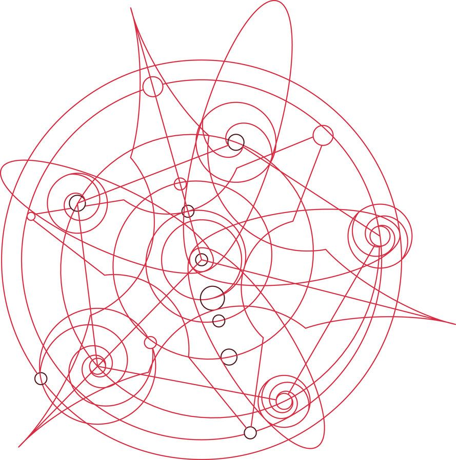
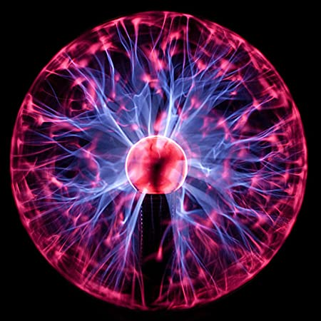
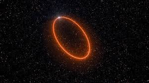
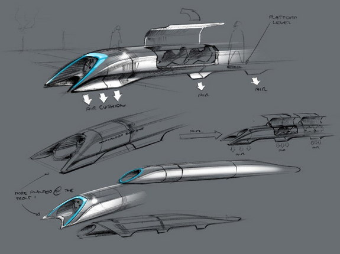

"I do not know what I may appear to the world, but myself, I seem to have been only like a boy playing on the seashore, and diverting myself in now and then finding a smoother pebble or a prettier shell than ordinary. Whilst the great ocean of truth lay all undiscovered before me."

The first great man used to work 18 hours a day, seven days a week. 
He started his life as a higher priest of humanity at the age of 19 at trinity.
At the time, he was full of self-hate because of his past thoughts and experiences. Perhaps he became world-famous at the age of 26.
He discovered almost five secrets of the universe which made life a lot easy for others.

"What we now want is closer contact and better understanding between individuals and communities all over the earth, and the elimination of egoism and pride which is always prone to plunge the world into primeval barbarism and strife... Peace can only come as a natural consequence of universal enlightenment..."

The second Great Man comes in the picture as an intense mad persona same as First Great Man. They both have almost 90% similarity in day-to-day life.
He began his life at the age of 26. He was more insane than others. Once, he decided to read the whole library of the University of Budapest. He used to work 20 hours a day for his first year in university. After the second year, he was very disappointed with the foolishness of this world.
He was the only man in history who was able to cause a man-made storm that was seen all over Europe. He was the first one to invent wireless communication way ahead of his time.

Although, modern life is so grateful for these two individuals.

It's time to come back from the blossom of the old world and see how modern great man changed the world.

"Try not to become a man of success but rather try to become a man of value."
The third great got abandoned in his land, he came to the land of America. At Princeton, he taught Physics and values to humanity.
He was a big head freak. He tries his best to stop atomic bomb creation. Then he never wants to live on the earth, so he went.
Almost everyone alive today knows about him.
Nothing more to say.

"Innovation distinguishes between a leader and a follower."

Another Rebel sparkled path for everyone who wants to discover something extraordinary.
Not talk too much, come on and follow my league. Dropped out of college at age of 18, start doing jobs after his 19th birthday, founded Apple after the age of 22. With time, his passion and love for his work grew mature enough that was able to inspire every upcoming generation.

"I think you should always bear in mind that entropy is not on your side."

Our present great man changed the meaning of life for everyone who wants to change things for the betterment.
He came from nowhere and become the greatest pioneer of technology for this decade. He is fifty now. But I hope he lives at least more than 10+ years more.
 
That's all, these above are the inspiration behind the perfect world and we'll achieve our goal at any cost.

