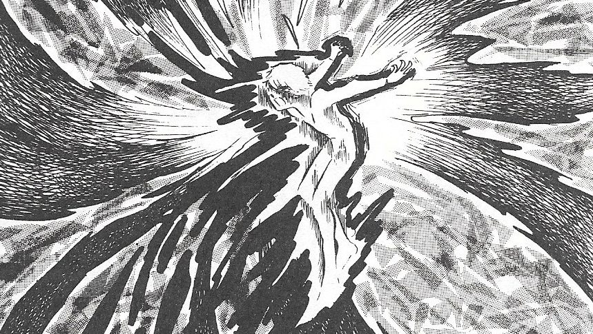

**Opening**

*Individual Power can change the Universe.*

<p align="center">

</p>

"*Cappuccino! small red mug, Table 0.45*", shouted man on counter.
<br />
A Young man in his early twenties raise waved his hand across counterman. He had figure like bum. Old suicidle jacket with punky stickers and mining-workers boots with a gay smile on his face, this man is Alxender Clarrk.He used to work on lunar city xx0ms in Arjun Expedition, a planet's mining company. He came to Spancer for a *cronic surgery* of his mind. Cronic Surgery is kind of a  meditiation and way to acheive mindfullness for mining servicemans. Every year a million people from all over the `milkyway` came to Spancer for various medical treatments and in search of other great things which only exist on greatest planet of measurable *Knotor* (known universe).

Alxender often feels sudden and deliberate attacks of anxiety. Though he prefers to drink milky things in red mugs because other mugs which exists on xx0ms and Spancer's cities are give him a temprament of losing something. And also red mugs are the cheapest ones.

"Proceeding 244 degree right - 32.3 degree left , target label 0.45, cupon name :   Alxender Clark",fuzzing Tobby.
Tobby steel body cann't move fast between the iron tables but he is faster than any human. When Alxender touch his mug , he liked the warmth of it. When he received mug and return token message in his phone. He thanked Tobby. 
<br />
"It's my pleasure Mr. Clark, !Hope you like Our Service ", said Gray Machine which is standing before his table.
He chuckled on Tobby's complements.
<br />
"When do you think I can return to xx0ms ?", asked Alxender.
<br />
"In 420 hours ", replied Dr. Sinha.
<br />
Dr. Sinha is a tall man with less hair on his head. He currently examining condition of Alxender's nervous system and doing his analysis if he need a neural surgery or just cronic meditiation would be enough.

```bash
Scan Started | Time: 12:07:20 PM | id : International Insitute for Medical Innovation, Spancer

[*] "No Brain Injury found!"
[-] found CWP
[!] Running Scripts for cwp.... 
[*] 10% scan completed
[*] 75% scan completed
[*] 100% scan completed
[\/] Found Pneumoconiosis
[/\] Complete report download in .log file successfully.

```
A Report of 2 pages got printed my Dang and flush out in front of Dr. Sinha's Table. 
"Alxender Clark , weight 70 kg , O+ve , found pneumoconiosis ", buzzing Dang added , "Do you want me to read Complete Report Sir ? "
<br />
"No need , Go and get me a Xpan", replied Dr.
<br />
"ok sir", said Dang. And start moving towards door of checkup room. 
<br />
Alxender was sitting on chair besides door. When he listened Dang to saying about pneumoconiosis , he does not understand clearly. After all Dang is a robot special neural networks which are trained in field of medical science and assisting doctors. 
<br />
"come ahead", said Dr. Sinha, nodding his eyes towards Alxender.
Alxender get up from chair and moved towards Doctor. 
<br />
"This is the big problem with uneducated peoples like you , who hides their anything from their doctors", said Dr.
Alxender remains slient.
<br />
"You said , your parents were not working in mines and you were their for only one year", said Dr. Sinha with a irritation in his voice.
<br />
"Yes, sir", replied Alxender with a clear voice.
<br />
"But you got Pneumoconiosis", said Dr. Sinha wideing his arm and giving a gesture of fool.
<br />
"What that means Dr., I don't understand", said Alxender.
<br />
"It's a lung disease", said Dr. Sinha who is trying to raise himself up against his chair. "If you are working in mines since last year then how could you be diagnoised with pneumoconiosis" added Dr. Sinha, moving toward windows of his room.
<br />
"So what? What is relational between my disease and mines", gribbled Alxender with little red face.
<br />
"It's a defect of working in coal mines. Pneumoconiosis is also known as Black Lungs. It is commonly found in coal mine workers who were working in mines for a long time of their lives, but you are just 21 , how can you be? And as you said, your parents never worked in mines. `Then how could someone be diagnose with something like black lungs in just one year.`"
<br />
Alxender who was looking staring at blank glass of water on doctor's table, heard about black lungs before. But he didn't said anything to Dr. Sinha. He remained silent just staring below on water glass. 
<br />
"May I come in, Sir", a robi voice coming in from the door of room.
<br />
"*Come In*", replied Dr. Sinha in a loathen way.


