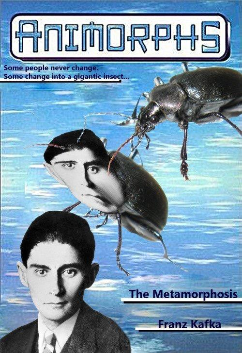
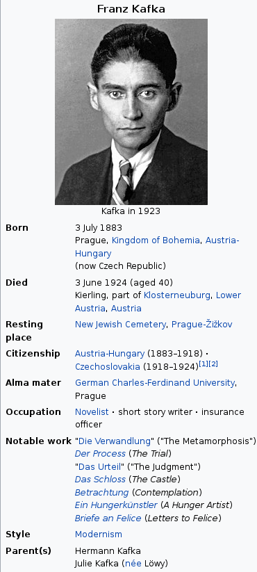
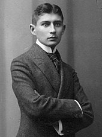
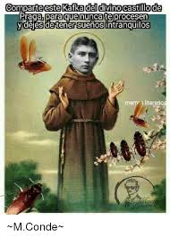
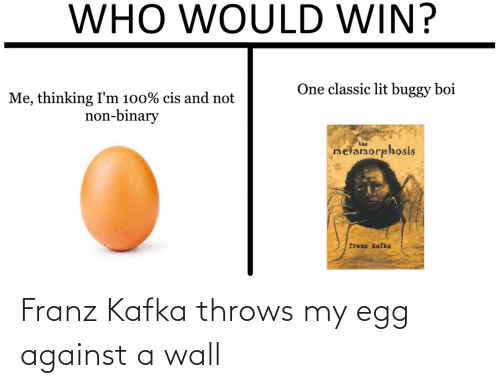

### Franz Kafka: Biography

Kafka was born into a middle-class German-Jewish family in Prague, the capital of the Kingdom of Bohemia, then part of the Austro-Hungarian Empire, today the capital of the Czech Republic.He trained as a lawyer and after completing his legal education was employed full-time by an insurance company, forcing him to relegate writing to his spare time. Over the course of his life, Kafka wrote hundreds of letters to family and close friends, including his father, with whom he had a strained and formal relationship. He became engaged to several women but never married. He died in 1924 at the age of 40 from tuberculosis.

### Personality: Something different
Franz had a  lifelong suspicion that people found him mentally and physically repulsive. However, those who met him invariably found him to possess a quiet and cool demeanor, obvious intelligence, and a dry sense of humour; they also found him boyishly handsome, although of austere appeararence.

He was recited as sexual tortured man. He visited brothels  almost  all his adult life. He had lived in many relationships with several women and We found diary  and letters about his love life & affairs  written by him at that time.Also noticable fact , he preferred absolute quiet when writing while he appeared as a socially extroverted.
> The story of his death goes like this: He fought with his father all his life who was a represented strong man but kafka was opposite . He was weak , sexually fail and unmarried but entertaining personality , he loved to sharing humor with friends.  A man "Brod" his one of the closest person . At his death time he handed all his papers and writing to Brod and asked him to lit them away. But Brod published all his writing one by one. Thus , Franz kafka never seen fame in his life. He died miserable. 

### Novelist or Depressed Intellectual
Kafka is one of the biggest name of 20th century in literature . But we find him very different in his writing style with respect to his behaviour. The way of his imagination and art of putting every element of story in such details while missing theme setter topic's insights. Nonetheless as he describes his characters in stories and slowly slowly give every insight of there past and future ambitions without any subtle mistake but after reading half of his written story we find out this is so confusing because it didn't contain any detailed insight of main character or concept. 

Precisely speaking , He submits some pinpoint queries in Reader's mind and then forces him/her towards searching out for full insight which he/she'll never find out. For example in "THE TRIAL" : he didn't clear why mr. K got arrested and why he was facing all that fuss jazzy trial. But he wrote every detail of other elements of story. 

His depression, sexual torture , illness, darkness and some part of unscientific imagination gives him an edge over all of other writers.

### Top Reads of Kafka
As we know he was not a professional writer and he used to work in some insurance firms, interested in pronography and many physical activities. His friend published his all work after his death which lead his name for hundreds of years without any hurdle. Kafka is famous for his different imaginative writing body and putting imagination slightly in Reader's head.
So his most creative writings are listed below :

> The Metamorphosis

> The Trial

> In The Penal Colony

> The Castle

> A Country Doctor

> Franz Kafka's Diaries (1910-23)

That's all for now , soon I will wank over Haruki Murakami and Harivansh Rai Bachchan's work. Until then if you got something interesting and want to share then contact me on my Twitter - @mezrahul. 
!!Thanks for your read.