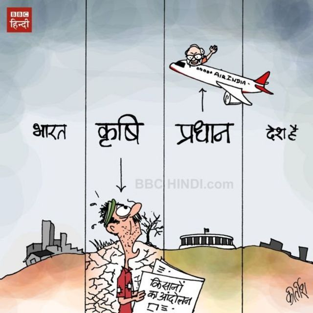
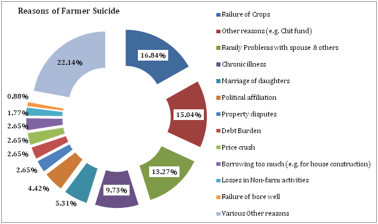
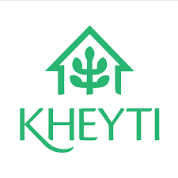
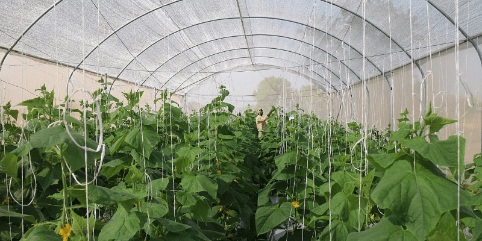

---

title: Kheyti 'THE STARTUP'
date : "2020-11-16"
description: In this blog post, we are going to review primary statics on suicides of farmers and agriculture based smart startups as Kheyti .Kheyti is one of most emerging startups on agriculture solutions.
 
---
 
### BHARAT :  एक कृषि प्रधान देश
I know heading which is written above throwing an random image form your memories of school exams where you have to write an essay on this topic. And I am pretty sure that would be the case today as well.
Agriculture is the principal source of livelihood for a majority of Indian population and the history of agriculture in our country dates back to the Rigveda.
India has atleast 55%-62% farmers in it's heart. 
Agriculture contributed 15.96-16.06 percent of GDP last year of 2019.
And The total number of farmers / farm labourers who died by suicide in 2019 was 10,281, according to the National Crime Records Bureau publication titled Accidental Deaths and Suicides in India 2019, Narendra Singh Tomar, Union minister of agriculture and farmers welfare, told the Rajya Sabha September 18, 2020. This accounted for 7.4 per cent of the total deaths by suicide (139,123) during 2019, he added.
According to a report in 2016, In India one farmer dies because of hunger in every 47 minute.

Our country have tens of millions of peoples below the poverty line.
Last year according to a report by World Data Lab," the effects of these methodological adjustment will result in a level of extreme poverty of India today of 50 million people , which will come down to 40 million by end 2019." But 2020 will change all the graphs of India without making any noise.India got a drastic amount of population which will make some difference all over places for worse conditions.

The idea of India is quiet different from BHARAT. Majoraly, INDIA was introduced by Pt. Nehru back in 1945-50 which considered itself as an abstractive reality of West part of world. While coming through so many years in 2020's last , we should be aware of our pseudo western reality and focus on our own Strengths and Weaknesses as a society of developing country.

While following the soul of country , we get some idea that "भारत एक कृषि प्रधान देश है".
As back to the Topic there is some sort of a rant in Indian startup eco system for Solving Problem of Farming and Changing Life's of millions of peoples.
These Startups gentally provides AI based solutions for small farmers and help them to more productive yields.

### Kheyti

Kheyti is an agri tech startup offering a smart solution to high agricultural costing.
Kheyti was started in 2015 with the mission of giving small farmers a steady and dependable income through market driven technology solutions.

Kheyti was founded by Satya and Ayush. 
The farmers are benefited with a lot of services all thanks to Kheyti. They receive benefits that include –

<iframe width="560" height="315" src="https://www.youtube.com/embed/dtFkvUnZ39M" frameborder="0" allow="accelerometer; autoplay; clipboard-write; encrypted-media; gyroscope; picture-in-picture" allowfullscreen></iframe>

* Modular farming solutions at affordable prices
* End – to – end services provided at their doorsteps
* Internet and e- enables services at the comfort of the farmers
* Improved quality of crop yield increasing the overall profit of the farmers

###### “Greenhouse-in-a-Box”

###### Just a thought experiment nothing else!
Thanks for your read!!