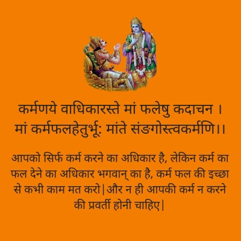
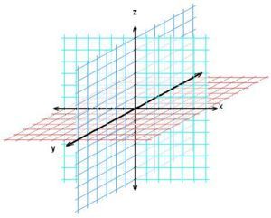
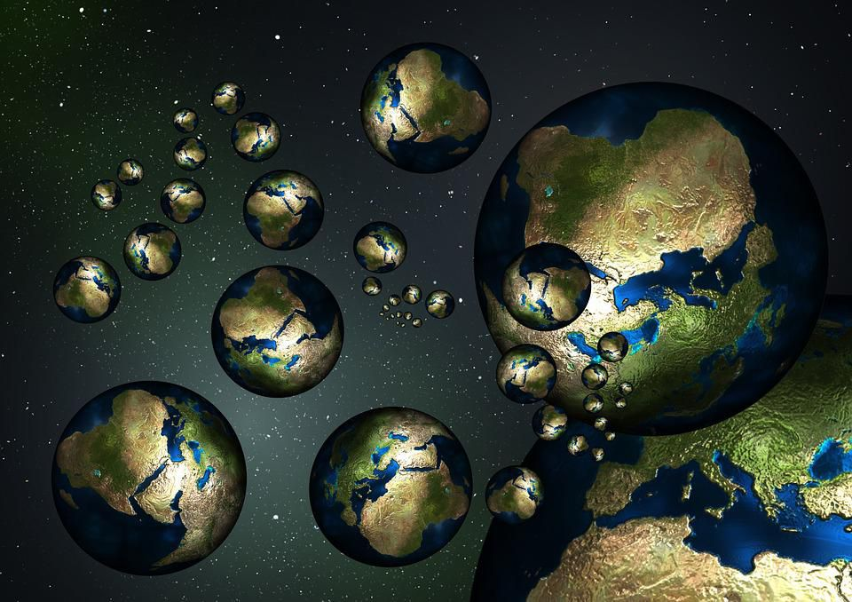
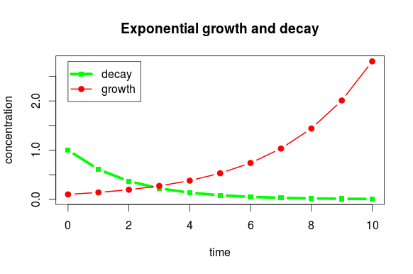
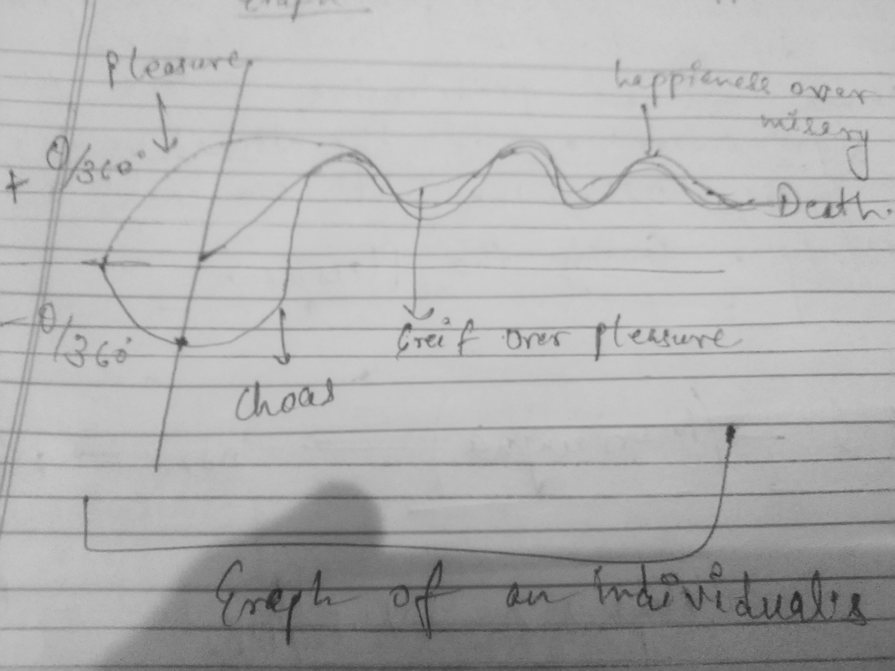
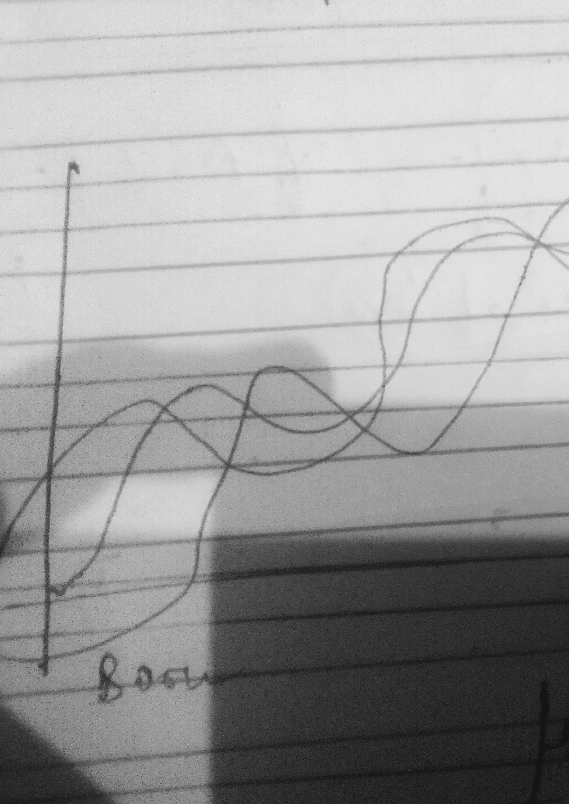

#### Just Reinvent Epic
Human beings are prepared, biologically, to respond to anomalous
information—to novelty. This instinctive response includes redirection of
attention, generation of emotion, and behavioral compulsion .
But wait isn't it a well-known thing ?
What about the events of life....?

##### Predeterministic World
Krishna's said in Geeta, something like ," I am the creator of this universe, everything is a part of me and it will end up towards me . Every event is written by me and you are playing a role. And you don't have any right to change or modify the conclusion ". From here the belief of 

 
 emerges.

### Life > 3

>Imagine:

There are three parallel universes those goes connected cause of third dimesional extensions. 

> First : Choatic Universe [-&#952;]

> Random > Our Universe [0]

> Second : Orderic Universe [+&#952;]

###### Choatic Universe
This universe is contianed of choas , disorder ,failure and malevolence.
 
###### Orderic Universe
This universe is full of order, winnings and happiness.

#### Third Dimensional Connection
So taking an individual example of frame , 
In a person's life events take part random , almost every people suffers with misery and failure. People ended up finding themseleves between into core of choas. And rest of the time struggles inorder to settle down these failures into winnings and events of containing happinative emotions . Some people get into suffering because of their chaotic partners and some gets reward as money , fame and supportive partners in life. But the question is ,

> "Who is determining these all events of every being's life ?"

* God > No way
* A Directory > like Google's Firebase store which add data in the real time (that can also be GOD).
* Cosmos > Natural Dark Energy and Beyond
* Logic Brahma > ( !Abstraction )

So our every event or ouccerance coming from or more precisely effecting or let me say happening because of these two parallel universes. 

Our lives exporting choas from chaotic world and order from orderic world in a manner to complete a zig-zag path of our life (on an individual level).
But exporting ?? No.. 
Logic Brahma ( just an another idea of my head ) who engineered all this game , settled up every thing in a manner of elegance. We cann't say , we are exporting or it's happening because of Logic Brahma's engineering mathmatical rules . Again it's come to next of predeterministic worlds.
So already ,two linear worlds event's interrupting our world's lives and generating random events.

> Point of Intersection 

Where frequency of three individual events get matched and then this event occures on any earth's being. {This means , 
In +&#952; world, you are a winner and in -&#952; world , you are a loser.
}
Parameters for calculating this frequency are established by the unknown authority (Logic Brahma).

Decay is -&#952;
 
Concentration is +&#952;

"Whichever or whatever events associated with dsyfunctioning ,disorder, greif; coming from -&#952; world and events are which cause order, happiness or satisfication; coming from +&#952; and on a frequency , where these events got intersected with each-other and earth's being's life line, there this subsequent event take place. Sum of -&#952; and +&#952; is a constant (0) which exists on our earth."

>> &#952; + (-&#952;) = 0 (constant)

Graph Representations

>B/w Death and Born

##### Last Words

Above idea of Three parallel universes can be mulitplied by many other aspects of chaos and order and be more complicated by standpoint of reader and practioner. 
-&#952; and +&#952; cann't be real because it will became representation of failed Physics, especially of 
:General Theory of Relativity:. According to earth's physists," multi-dimesional world's are smaller than the size of electron if they exists." So this idea of three parrallel worlds is revolt against laws of human physics and earth dynamics (may be).
Maybe somewhere in any world, my #sexsy cuck Sundram will become a model.

###### This writeup is not well-articulated and lacks some mathmatical representation. Idea of Three parallel world's came up in mind , somewhere studying trigonometry two or three years back. I will try to find out my exact papers of this writing (just got 1 paper of graphs) and attach them here. If you have any other interruptation of this abstractive idea then please hit me at my twitter(@mezrahul) inbox.