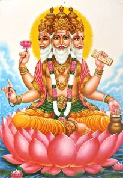

---

title: Logic Brahma
date: "2020-11-25"
description: Another abstraction that can change your world view for forever and for never.

---

###### Brahma

Brahma (Sanskrit: ब्रह्मा) is the creator god in Hinduism.He is also known as Svayambhu (self-born), Vāgīśa (Lord of Speech), and the creator of the four Vedas, one from each of his mouths. Brahma is consort of Saraswati and he is the father (creator) of Four Kumaras, Narada, Daksha, Marichi and many more. He is more prominently mentioned in the post-Vedic Hindu epics and the Puranas.

###### Logic Brahma
So this territory called logic brahma is no more different from Real Brahma.
But Logic Brahma espacially stands for a normal physical and mental powers. 
People are worshiping GOD for thousands of years?
But what if there will someone who became the NEW GOD?
* God who just see things verbally ,

* who engineers things, who creates ideas , who challanges everything for betterment, who pushes the human race to it's extreme for good. 

* Who takes risks for not personal gain but for human race's gain.

* He discover truth hidden in the abyss. He conceptualizes logic . He do things those seem impossible to others.

> Last but not Least 

* They leads the Earth, they changes human race's dynamics.

##### ANYONE FROM ANYWHERE CAN BECOME LOGIC BRAHMA. 

###### A short preview of Thoughts.
